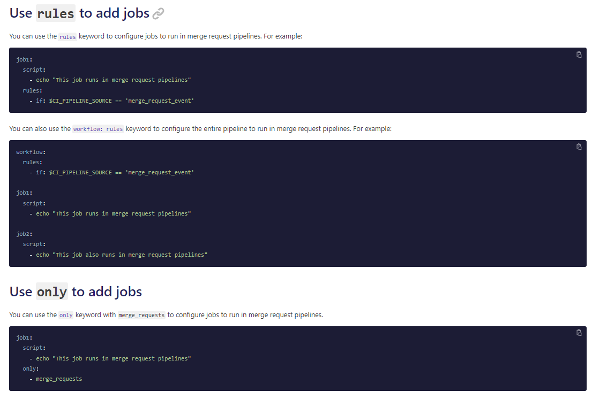

# MyGitLab

My GitLab

## My GitLab (pipeline + Merge Request template) + GCP (GCS + BigQuery + CLI) + Python + Shell project

### Business flow

- Data Owner (not technical)
  - Check data
  - Create data changes (follow the rules)
  - Create the request

- Data Governance (not technical)
  - Approve or decline the request

- Data Operator (technical)
  - Create GitLab feature branch based on the approved SNOW request
  - Submit the MR (merge request)

- Data Governance (not technical)
  - Approve the merge request based on the MR checklist (template)

- GitLab
  - Do some validations with Python (e.g. a csv file needs to have a json file to have the same schema)
  - Only pick up the file changes in the MR with CLI
  - Sort the file changes bases on the different environments / GCP projects with CLI
  - Create all the scripts bases on the different environments / GCP projects with Python
  - Merge the data from GitLab repo to BigQuery tables (reload with the csv and json files) with CLI
  - Merge the data from GitLab repo to GCS buckets (sync) with CLI

- Downstream applications
  - Enjoy the new data

### Details

[A GitLab pipeline example](a_GitLab_Pipeline_Example.md)

### Different approach with pure Python (didn't use)

BigQuery Client Libraries

<https://cloud.google.com/bigquery/docs/reference/libraries#client-libraries-install-python>

`pip install --upgrade google-cloud-bigquery`

```python
from google.cloud import bigquery

# Construct a BigQuery client object.
client = bigquery.Client()

query = """
    SELECT name, SUM(number) as total_people
    FROM `bigquery-public-data.usa_names.usa_1910_2013`
    WHERE state = 'TX'
    GROUP BY name, state
    ORDER BY total_people DESC
    LIMIT 20
"""
query_job = client.query(query)  # Make an API request.

print("The query data:")
for row in query_job:
    # Row values can be accessed by field name or index.
    print("name={}, count={}".format(row[0], row["total_people"]))
```

Cloud Storage client libraries

<https://cloud.google.com/storage/docs/reference/libraries#client-libraries-install-python>

`pip install --upgrade google-cloud-storage`

```python
# Imports the Google Cloud client library
from google.cloud import storage

# Instantiates a client
storage_client = storage.Client()

# The name for the new bucket
bucket_name = "my-new-bucket"

# Creates the new bucket
bucket = storage_client.create_bucket(bucket_name)

print(f"Bucket {bucket.name} created.")
```

## GitLab 2FA

Got a tricky issue for a while and finally resolved it

Root cause:

The timezone needs to be the same with the GitLab server!

Steps:

```dos
- install Google auth app in my iPhone
- Scan QR code to add my GitLab account
- General -> Settings -> Time zone -> if my TZ is different with then GL server, don't use auto, change it to the same as GL server's (very import)
- Hooray
```

## GitLab CI/CD pipeline

### Simple

.gitlab-ci.yml

```yaml
stages:
    - build
    - test

build:
    stage: build
    script:
        - echo "Building"
        - mkdir build
        - touch build/info.txt
    artifacts:
        paths:
            - build/

test:
    stage: test
    script:
        - echo "Testing"
        - test -f "build/info.txt"
```

### GitLab Runner

### Docker Image

```yaml
...
```

### Free GitLab + Free Netlify ???

### GitLab + GCP (Google Cloud SDK) + Skaffold

Skaffold is a command-line tool developed by Google that makes it really easy to setup CI/CD for local, development and production environments with Kubernetes. It handles the full workflow of building and pushing docker containers to the docker container registry, and deploying applications to Kubernetes.

Skaffold doesn't require any server-side components to be installed in the Kubernetes cluster. All it needs is to have the necessary credentials to access the Kubernetes control plane API server. This is great because it means that you can run Skaffold pretty much from anywhere.

Dockerfile_skaffold

```docker
FROM google/cloud-sdk:alpine

ENV DOCKER_HOST tcp://localhost:2375/
ENV DOCKER_DRIVER overlay

RUN apk upgrade --no-cache \
  # Install common tools
  && apk add --no-cache bash curl wget make git py-pip \
  gcc g++ linux-headers binutils-gold gnupg libstdc++ libgcc ca-certificates tar jq \
  # Install skaffold
  && curl -Lo skaffold https://storage.googleapis.com/skaffold/releases/latest/skaffold-linux-amd64 \
  && mv skaffold /usr/local/bin/ \
  && chmod +x /usr/local/bin/skaffold \
  && skaffold version
```

Docker build

```bash
docker build -f Dockerfile_skaffold -t <my-username>/skaffold-and-gcloud 
```

Docker push

```bash
docker login
docker push <my_docker_repo>/skaffold-and-gcloud:latest
```

.gitlab-ci.yml

```yaml
image: "<my_docker_repo>/skaffold-and-gcloud"

services:
 - docker:dind

stages:
  - build
  - review
  - production

variables:
  DOMAIN_NAME: example.com
  PRODUCTION_DOMAIN_NAME: example.com

build_review:
  stage: build
  environment:
    name: $CI_COMMIT_REF_NAME
    url: "https://$CI_ENVIRONMENT_SLUG.$DOMAIN_NAME"
    on_stop: stop_review
  script:
    - <do_build>
  only:
    - branches
  except:
    - main

build_production:
  stage: build
  environment:
    name: production
    url: "https://$PRODUCTION_DOMAIN_NAME"
  script:
    - echo 'doing build_production'
  only:
    - main

recreate_review:
  stage: review
  script:
    - echo 'doing recreate_review'
  environment:
    name: $CI_COMMIT_REF_NAME
    url: "https://$CI_ENVIRONMENT_SLUG.$DOMAIN_NAME"
    on_stop: stop_review
  when: manual
  only:
    - branches
  except:
    - main
  dependencies:
  - build_review

deploy_review:
  stage: review
  script:
    - echo 'doing deploy_review'
  environment:
    name: $CI_COMMIT_REF_NAME
    url: "https://$CI_ENVIRONMENT_SLUG.$DOMAIN_NAME"
    on_stop: stop_review
  when: manual
  only:
    - branches
  except:
    - main
  dependencies:
  - build_review

stop_review:
  stage: review
  script:
    - echo 'doing stop_review'
  environment:
    name: $CI_COMMIT_REF_NAME
    url: "https://$CI_ENVIRONMENT_SLUG.$DOMAIN_NAME"
    action: stop
  dependencies:
    - build_review
  when: manual
  except:
    - main

deploy_production:
  stage: production
  script:
    - echo doing deploy_production
  environment:
    name: production
    url: "https://$PRODUCTION_DOMAIN_NAME"
  when: manual
  only:
    - main
  dependencies:
  - build_production
```

dind : docker in docker

### GitLab + GCP

.gitlab-ci.yml

```yaml
default:
    image: google/cloud-sdk:alpine
    before_script:
        - gcloud config set project <my_gcp_project>
        - gcloud auth activate-service-account --key-file $GCP_SERVICE_CREDS

build:
    stage: build
    script:
        - gcloud build submit --tag gcr.io/<my_image_url>:latest

deploy:
    stage: deploy
    script:
        - gcloud run deploy <my_cloud_run_service> --image gcr.io/<my_image_url>:latest --platform managed --region us-west1 --allow-unauthenticated
```

### How to trigger a GitLab pipeline

#### Use a CI/CD job - yes

For example, to trigger a pipeline on the `main` branch of `project-B` when a tag is created in `project-A`, add the following job to project A's `.gitlab-ci.yml` file:

```yaml
trigger_pipeline:
  stage: deploy
  script:
    - 'curl --fail --request POST --form token=$MY_TRIGGER_TOKEN --form ref=main "https://gitlab.example.com/api/v4/projects/123456/trigger/pipeline"'
  rules:
    - if: $CI_COMMIT_TAG
```

In this example:

```dos
123456 is the project ID for project-B. The project ID is displayed at the top of every project's landing page. 
(can it be changed as )

The rules cause the job to run every time a tag is added to project-A.

MY_TRIGGER_TOKEN is a masked CI/CD variables that contains the trigger token.
```

#### Use a webhook - maybe

```dos
https://gitlab.example.com/api/v4/projects/<project_id>/ref/<ref_name>/trigger/pipeline?token=<token>
```

#### Use cURL - nah

```dos
curl --request POST \
     --form token=<token> \
     --form ref=<ref_name> \
     "https://gitlab.example.com/api/v4/projects/<project_id>/trigger/pipeline"
```

or

```dos
curl --request POST \
    "https://gitlab.example.com/api/v4/projects/<project_id>/trigger/pipeline?token=<token>&ref=<ref_name>"
```

### How to trigger my GitLab pipeline by the event of a new file has been dropped to my GCS bucket

With GitLab, your pipelines run inside containers. So you can specify a container image that already has gsutil installed. No need to reinstall it every time it runs. Google maintains a container image called google/google-cloud-sdk that contains a lot of GCP command line tools pre-installed (writing this off the top of my head, the actual name may be slightly different).

So in your case you'd want a '.gitlab-ci.yml' file in the root of your repo that specifies the right container image, a “stage” to define your pipeline job, and then a set of commands to upload your file.

You'll also want to store the credentials to access the GCP bucket somewhere in GitLab. Easiest option that isn't too insecure is to store it in GitLab “secrets” which you'll find in your repository's settings page. You can give your secret a variable name and the value (which could be a GCP service account .json file). Then you can reference it in your pipeline as a normal environment variable.

Putting it all together, it could look something like this:

```yaml
image: google/google-cloud-sdk

stages:
  - upload_file

upload_file:
  script:
    # Setup credentials file to access GCP from our environment variable
    - echo "$GCP_SERVICE_ACCOUNT_JSON" > <my-service-account-json-file>  # e.g. service-account.json
    - gcloud auth activate-service-account —key-file <my-service-account-json-file>
    - gsutil cp <file_from> <file_to>

  after_script:
    # Cleanup service account credentials file
    - rm <my-service-account-json-file>
    # Archive the processed file?
    - mv <file_to> <file_archive_name>

  # Only run this job when this file is changed in a commit
  only:
    refs:
      - branches
    changes:
      - <file_that_triggers_the_upload>
```

<https://docs.gitlab.com/ee/ci/yaml/#onlychanges--exceptchanges>

Example of only:changes:

```yaml
docker build:
  script: docker build -t my-image:$CI_COMMIT_REF_SLUG .
  only:
    refs:
      - branches
    changes:
      - Dockerfile
      - docker/scripts/*
      - dockerfiles/**/*
      - more_scripts/*.{rb,py,sh}
      - "**/*.json"
```

Additional details:

```dos
changes resolves to true if any of the matching files are changed (an OR operation).
If you use refs other than branches, external_pull_requests, or merge_requests, changes can’t determine if a given file is new or old and always returns true.
If you use only: changes with other refs, jobs ignore the changes and always run.
If you use except: changes with other refs, jobs ignore the changes and never run.
```

## GitLab set up

Too complicated

Too many tricks

GitHub Actions will win this game.

### SSH key

This is the only easy item.

### Perosnal Access Token

Very tricky

Don't tick all the check boxes!

### PGP key

Very tricky for Windows users

The offical documentation has problems!

Solution: use the full path of pgp!

## GitLab issues

There are lots of defects for different versions.

### git diff / git diff-tree $CI__SHORT_SHA

This one doesn't work properly!

Try with these ideas:



```dos
merge request pipeline 

+<sha>:refs/pipelines/<id>
```

$CI_PIPELINE_SOURCE

How the pipeline was triggered. Can be push, web, schedule, api, external, chat, webide, `merge_request_event`, external_pull_request_event, parent_pipeline, trigger, or pipeline. For a description of each value, see Common if clauses for rules, which uses this variable to control when jobs run.

## Misc

GitLab flavoured Markdown (GLFM)
