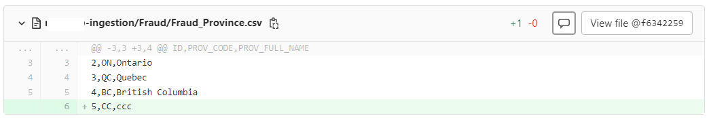

# My GitLab Pipeline example

## #1 Merge Request is not open; Feature branch no csv updates

```dos
CI_BUILD_REF_NAME is: feat/summarize
CI_COMMIT_REF_NAME is: feat/summarize
CI_MERGE_REQUEST_APPROVED is:
CI_PIPELINE_SOURCE is: push
CI_DEFAULT_BRANCH is: master
CI_MERGE_REQUEST_SOURCE_BRANCH_NAME is:
CI_MERGE_REQUEST_TARGET_BRANCH_NAME is:
CI_COMMIT_SHA is: ef98b990875765b50ed55657a1a09de43483092d
CI_MERGE_REQUEST_SOURCE_BRANCH_SHA is:
CI_MERGE_REQUEST_TARGET_BRANCH_SHA is:
 ...
git diff --name-only origin/master
.gitlab-ci.yml
check_diff.sh
check_diff_mr.sh
 ...
git diff-tree --diff-filter=d --no-commit-id --name-only -r ef98b990875765b50ed55657a1a09de43483092d
.gitlab-ci.yml
check_diff.sh
check_diff_mr.sh
 ...
[All environments (my-ing, my-dev, my-tst, my-prod)] No csv file changes detected!
```


## #2 Merge Request is not open; Feature branch has csv updates

```dos
CI_BUILD_REF_NAME is: feat/summarize
CI_COMMIT_REF_NAME is: feat/summarize
CI_MERGE_REQUEST_APPROVED is:
CI_PIPELINE_SOURCE is: push
CI_DEFAULT_BRANCH is: master
CI_MERGE_REQUEST_SOURCE_BRANCH_NAME is:
CI_MERGE_REQUEST_TARGET_BRANCH_NAME is:
CI_COMMIT_SHA is: 7fe2ebe037c281ae7d02295019d9e1780aeaf1ac
CI_MERGE_REQUEST_SOURCE_BRANCH_SHA is:
CI_MERGE_REQUEST_TARGET_BRANCH_SHA is:
 ...
git diff --name-only origin/master
.gitlab-ci.yml
check_diff.sh
check_diff_mr.sh
my-dev/Fraud/Fraud_Language.csv
 ...
git diff-tree --diff-filter=d --no-commit-id --name-only -r 7fe2ebe037c281ae7d02295019d9e1780aeaf1ac
my-dev/Fraud/Fraud_Language.csv
 ...
cat diff.txt
my-dev/Fraud/Fraud_Language.csv
[my-ing] No csv file changes detected!
[my-dev] Some csv file changes detected:
cat my-dev_diff.txt
my-dev/Fraud/Fraud_Language.csv
[my-tst] No csv file changes detected!
[my-prod] No csv file changes detected!
```


## #3 Merge Request is open; Feature branch has not csv updates

Note: another "duplicated" pipeline got triggers as soon as the MR got created.

But it only has 1 valid stage so it is OK.

```dos
CI_BUILD_REF_NAME is: feat/summarize
CI_COMMIT_REF_NAME is: feat/summarize
CI_MERGE_REQUEST_APPROVED is:
CI_PIPELINE_SOURCE is: merge_request_event
CI_DEFAULT_BRANCH is: master
CI_MERGE_REQUEST_SOURCE_BRANCH_NAME is: feat/summarize
CI_MERGE_REQUEST_TARGET_BRANCH_NAME is: master
CI_COMMIT_SHA is: 65f97c28b86baebbed65447a42b7679b9d8f174d
CI_MERGE_REQUEST_SOURCE_BRANCH_SHA is:
CI_MERGE_REQUEST_TARGET_BRANCH_SHA is:
 ...
git diff --name-only origin/master
.gitlab-ci.yml
README.md
check_diff.sh
check_diff_mr.sh
my-dev/Fraud/Fraud_Language.csv
 ...
git diff-tree --diff-filter=d --no-commit-id --name-only -r 65f97c28b86baebbed65447a42b7679b9d8f174d
README.md
 ...
[All environments (my-ing, my-dev, my-tst, my-prod)] No csv file changes detected!
```


## #4 Merge Request is open; Feature branch has csv updates

```dos
CI_BUILD_REF_NAME is: feat/summarize
CI_COMMIT_REF_NAME is: feat/summarize
CI_MERGE_REQUEST_APPROVED is:
CI_PIPELINE_SOURCE is: merge_request_event
CI_DEFAULT_BRANCH is: master
CI_MERGE_REQUEST_SOURCE_BRANCH_NAME is: feat/summarize
CI_MERGE_REQUEST_TARGET_BRANCH_NAME is: master
CI_COMMIT_SHA is: 725582ef71d15e288a0603dae5f2d997e1c00f18
CI_MERGE_REQUEST_SOURCE_BRANCH_SHA is:
CI_MERGE_REQUEST_TARGET_BRANCH_SHA is:
 ...
git diff --name-only origin/master
.gitlab-ci.yml
README.md
check_diff.sh
check_diff_mr.sh
my-dev/Fraud/Fraud_Language.csv
my-dev/Treasury/Treasury_Province.csv
 ...
git diff-tree --diff-filter=d --no-commit-id --name-only -r 725582ef71d15e288a0603dae5f2d997e1c00f18
my-dev/Treasury/Treasury_Province.csv
 ...
cat diff.txt
my-dev/Treasury/Treasury_Province.csv
[my-ing] No csv file changes detected!
[my-dev] Some csv file changes detected:
cat my-dev_diff.txt
my-dev/Treasury/Treasury_Province.csv
[my-tst] No csv file changes detected!
[my-prod] No csv file changes detected!
```

so far, #1 #2 #3 #4

`CI_BUILD_REF_NAME is: feat/summarize`


## #5 Merge Request is "merged" after the approvals; merged csv updates from feature branch to master

```dos
CI_BUILD_REF_NAME is: master
CI_COMMIT_REF_NAME is: master
CI_MERGE_REQUEST_APPROVED is:
CI_PIPELINE_SOURCE is: push
CI_DEFAULT_BRANCH is: master
CI_MERGE_REQUEST_SOURCE_BRANCH_NAME is:
CI_MERGE_REQUEST_TARGET_BRANCH_NAME is:
CI_COMMIT_SHA is: f634225966e3deb9a98756167343cc2e06c50dae
CI_MERGE_REQUEST_SOURCE_BRANCH_SHA is:
CI_MERGE_REQUEST_TARGET_BRANCH_SHA is:
```


```dos
CI_BUILD_REF_NAME is: master
CI_COMMIT_REF_NAME is: master
CI_MERGE_REQUEST_APPROVED is:
CI_PIPELINE_SOURCE is: push
CI_DEFAULT_BRANCH is: master
CI_MERGE_REQUEST_SOURCE_BRANCH_NAME is:
CI_MERGE_REQUEST_TARGET_BRANCH_NAME is:
CI_COMMIT_SHA is: f634225966e3deb9a98756167343cc2e06c50dae
CI_MERGE_REQUEST_SOURCE_BRANCH_SHA is:
CI_MERGE_REQUEST_TARGET_BRANCH_SHA is:
 ...
git diff --name-only origin/master
 ...
git diff --name-only f634225966e3deb9a98756167343cc2e06c50dae~1 f634225966e3deb9a98756167343cc2e06c50dae
.gitlab-ci.yml
check_diff.sh
check_diff_mr.sh
my-ing/Fraud/Fraud_Province.csv
 ...
cat diff.txt
my-ing/Fraud/Fraud_Province.csv
[my-ing] Some csv file changes detected:
cat my-ing_diff.txt
my-ing/Fraud/Fraud_Province.csv
[my-dev] No csv file changes detected!
[my-tst] No csv file changes detected!
[my-prod] No csv file changes detected!
```


`f634225966e3deb9a98756167343cc2e06c50dae`



